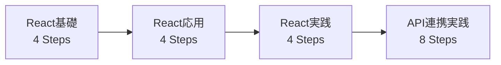

# Coden 企画書

> **ドキュメントバージョン**: v2.0  
> **作成日**: 2026年2月13日  
> **ステータス**: 企画フェーズ

---

## 1. ビジョンと目的

### 1-1. プロダクトビジョン

**「読んで終わり」から「書けるまで」への橋渡し**

多くのReact初学者は、チュートリアルを読んだだけで「分かった気」になり、実際にコードを書こうとすると手が止まってしまう。Codenは、**段階的な実践**を通じて「理解」から「実装力」への確実な成長を支援する学習プラットフォームである。

### 1-2. 開発の目的

| 目的 | 説明 |
|------|------|
| **学習の継続性向上** | ゲーミフィケーションとモチベーション設計により、挫折率を低減 |
| **実装力の獲得** | 段階的な演習により、「読める」から「書ける」へのギャップを埋める |
| **学習体験の最適化** | 一つのプラットフォームで基礎から実践まで完結する学習環境を提供 |

---

## 2. ターゲットユーザー

| ペルソナ | 前提スキル | 学習ゴール |
|---------|-----------|-----------|
| React初学者 | HTML/CSS/JSの基礎がある | Reactの基本概念を理解し「触ったことがある」状態に到達する |
| 初級者脱却を目指す人 | チュートリアルは終えたが自力で書けない | 自分でコンポーネントを設計・実装できるようになる |
| API連携を学びたい人 | Reactの基礎は理解している | fetch/REST APIを用いた非同期処理を実践する |

---

## 3. 解決する課題

### 現状の問題点

| 課題 | 説明 |
|------|------|
| **チュートリアル地獄** | 複数の教材を渡り歩くが、断片的な知識しか得られない |
| **実装力のギャップ** | 「読めば分かる」が「自分では書けない」状態が続く |
| **学習の継続困難** | フィードバックが少なく、進捗が見えないため挫折しやすい |
| **実践環境の不足** | API連携など実務に近い演習ができる環境が少ない |

### Codenによる解決策

- **4段階学習フロー**で知識の定着から実装力獲得まで一貫したカリキュラムを提供
- **即時フィードバック**と**進捗の可視化**により学習成果を実感
- **ゲーミフィケーション**によるモチベーション維持
- **模擬API環境**による実践的なAPI連携学習

---

## 4. プロダクト概要

**Coden（コーデン）** は、React初学者が「基礎概念」から「実践的なAPI連携」までを段階的に習得できるワンストップ学習プラットフォームである。

### コアコンセプト

```
📖 読む → ✏️ 埋める → 🧪 テストする → 🏆 書く
```

この**4段階学習フロー**により、受動的な学習から能動的な実装へと段階的にステップアップし、確実な知識定着と実装力の向上を実現する。

### 主要な特徴

- **Supabaseによる認証・データ管理**: ユーザーごとの学習進捗・統計を永続化
- **ゲーミフィケーション**: ポイント・実績バッジ・学習ストリークによるモチベーション維持
- **ブラウザ内コードエディタ**: 環境構築不要で即座に学習開始
- **模擬API環境**: 実務に近いAPI連携を安全に学習

---

## 5. 主要機能

### 5-1. 4段階学習フロー

各学習ステップは以下の4つのモードで構成される。

#### 📖 閲覧モード
- **目的**: 概念の理解
- **内容**: React公式ドキュメントに基づいた解説テキストとサンプルコード
- **機能**: シンタックスハイライト、コピーボタン

#### ✏️ 練習モード
- **目的**: 重要構文の暗記・定着
- **内容**: 穴埋め形式のクイズ（5〜6問/ステップ）
- **機能**: 即時正誤判定、ヒント表示、進捗トラッキング

#### 🧪 テストモード
- **目的**: コードリーディング力と修正能力の確認
- **内容**: 実際のコンポーネントコードの穴埋めテスト
- **機能**: 合格後にライブプレビュー解禁、ヒント表示

#### 🏆 チャレンジモード
- **目的**: 実装力・応用力の獲得
- **内容**: 仕様のみ提示、ゼロからの自由記述実装
- **機能**: コードエディタ、キーワードベース自動チェック、段階的ヒント、回答履歴保存

---

### 5-2. ダッシュボード

学習の進捗とモチベーションを可視化する中央画面。

| 要素 | 説明 |
|------|------|
| ウェルカムバナー | パーソナライズされた挨拶とマスコットキャラクター |
| 学習進捗カード | 現在のコース進行状況と完了ステップ数 |
| 今日の目標 | 日次の学習目標（学習・練習・復習） |
| 学習ヒートマップ | カレンダー形式での学習履歴可視化 |
| 学習統計 | 正解数・連続学習日数などの集計 |

---

### 5-3. 認証システム（Supabase Auth）

| 機能 | 説明 |
|------|------|
| 認証方式 | メール/パスワード、ソーシャルログイン（GitHub, Google） |
| セッション管理 | 自動セッション復元、トークンベース認証 |
| ルート保護 | 未認証ユーザーは学習画面にアクセス不可 |

---

### 5-4. ゲーミフィケーション

学習継続のモチベーションを維持する仕組み。

| 要素 | 説明 |
|------|------|
| **ポイント（Pt）システム** | 問題正解・ステップ完了・初回クリアなどで獲得 |
| **実績バッジ** | 特定条件達成で解禁（例：初チャレンジクリア、3日連続学習） |
| **学習ストリーク** | 連続学習日数のカウントと可視化 |
| **通知システム** | 実績解除時のアニメーション付きトースト通知 |

---

### 5-5. 学習用API環境

API連携コースで使用する模擬RESTful API環境。

| 項目 | 内容 |
|------|------|
| 提供機能 | カウンター操作、タスク管理（CRUD） |
| 対応メソッド | GET, POST, PATCH, DELETE |
| 目的 | 実務に近いAPI連携を安全に体験 |

---

### 5-6. プロフィールページ

| 機能 | 説明 |
|------|------|
| 学習統計 | 総学習時間、正解率、ストリークなどの詳細表示 |
| Pt履歴 | ポイント獲得履歴の確認 |
| 実績バッジ | 獲得済み・未獲得の実績一覧 |
| カスタマイズ | マスコットキャラクターの選択 |

---

## 6. 学習カリキュラム

### 全体構成（4コース・全20ステップ）



---

### コース1: React基礎（fundamentals）
> レベル: beginner ｜ Steps: 4

| # | ステップID | タイトル | 学習テーマ |
|---|-----------|----------|-----------|
| 1 | `usestate-basic` | useState基礎 | 状態管理の基本 |
| 2 | `events` | イベント処理 | ユーザー操作への反応 |
| 3 | `conditional` | 条件付きレンダリング | 条件に応じた表示切替 |
| 4 | `lists` | リスト表示 | 配列データの表示 |

---

### コース2: React応用（intermediate）
> レベル: intermediate ｜ Steps: 4

| # | ステップID | タイトル | 学習テーマ |
|---|-----------|----------|-----------|
| 5 | `useeffect` | useEffect | 副作用とライフサイクル |
| 6 | `forms` | フォーム処理 | 入力とバリデーション |
| 7 | `usecontext` | useContext | グローバル状態管理 |
| 8 | `usereducer` | useReducer | 複雑な状態ロジック |

---

### コース3: React実践（advanced）
> レベル: advanced ｜ Steps: 4

| # | ステップID | タイトル | 学習テーマ |
|---|-----------|----------|-----------|
| 9 | `custom-hooks` | カスタムHooks | 再利用可能なロジック |
| 10 | `api-fetch` | API連携 | データ取得とローディング |
| 11 | `performance` | パフォーマンス最適化 | useMemo/useCallback |
| 12 | `testing` | テスト入門 | React Testing Library |

---

### コース4: API連携実践（api-practice）
> レベル: intermediate ｜ Steps: 8

| # | ステップID | タイトル | 学習テーマ |
|---|-----------|----------|-----------|
| 13 | `api-counter-get` | カウンターAPI (GET) | APIからデータを取得する |
| 14 | `api-counter-post` | カウンターAPI (POST) | APIにデータを送信する |
| 15 | `api-tasks-list` | タスク一覧 (GET) | リストデータの取得と表示 |
| 16 | `api-tasks-create` | タスク追加 (POST) | フォームからのデータ送信 |
| 17 | `api-tasks-update` | タスク更新 (PATCH) | 完了状態の切り替え |
| 18 | `api-tasks-delete` | タスク削除 (DELETE) | APIからの削除処理 |
| 19 | `api-custom-hook` | useTasksフック | API操作のカスタムフック化 |
| 20 | `api-error-loading` | エラー/ローディングUI | APIの状態に応じたUI表示 |

---

## 7. 画面構成

### 7-1. ログイン画面
- メール/パスワード認証フォーム
- サインアップ/ログイン切替
- ソーシャルログインボタン（GitHub, Google）
- ブランディング要素（ロゴ、キービジュアル）

### 7-2. ダッシュボード（ホーム画面）
- ヘッダー（ポイント表示、ユーザー情報、ログアウト）
- ウェルカムバナー + マスコットキャラクター
- 現在学習中コースの進捗表示
- 今日の学習目標
- 学習ヒートマップ（カレンダー）
- 学習統計カード（正解数・連続日数など）
- おすすめコース一覧

### 7-3. 学習画面
- サイドバー（コース・ステップ一覧、完了状態表示）
- メインエリア（4タブ切替）
  - 📖 **解説タブ**: Markdown解説文 + サンプルコード
  - ✏️ **練習タブ**: 穴埋めクイズエリア
  - 🧪 **テストタブ**: コード穴埋めテスト + ライブプレビュー
  - 🏆 **チャレンジタブ**: コードエディタ + 課題仕様

### 7-4. プロフィール画面
- ユーザー情報表示
- 学習統計サマリー（総学習時間、正解率、ストリーク）
- ポイント獲得履歴
- 実績バッジ一覧
- マスコット設定

---

## 8. アーキテクチャ方針

### 8-1. レイヤー構造

```
プレゼンテーション層
 ├─ 画面コンポーネント（ダッシュボード、学習画面、プロフィール、ログイン）
 └─ UIコンポーネント（サイドバー、ヘッダー、モーダルなど）

状態管理層
 ├─ 認証状態管理
 ├─ 学習統計管理
 ├─ 実績管理
 ├─ ポイント管理
 └─ UIカスタマイズ管理

データ層
 ├─ Supabaseクライアント
 ├─ データアクセス層（学習データ、統計、実績など）
 └─ コンテンツローダー（Markdownファイル、コードサンプル）
```

### 8-2. ルーティング方針

| パス | 画面 | 認証 | 説明 |
|-----|-------|------|------|
| `/login` | ログイン画面 | 不要 | 認証フォーム |
| `/` | ダッシュボード | 必要 | ホーム画面 |
| `/step/:stepId` | 学習画面 | 必要 | 4段階学習画面 |
| `/profile` | プロフィール画面 | 必要 | 統計・設定 |

### 8-3. 状態管理戦略

- **グローバル状態**: React Contextによる状態管理
- **認証状態**: Supabaseセッション + Context
- **学習データ**: Supabaseからの取得 + ローカルキャッシュ
- **UI状態**: コンポーネントローカル状態

---

## 9. 技術スタック

### 9-1. フロントエンド

| カテゴリ | 技術選定 | 選定理由 |
|---------|---------|---------|
| フレームワーク | **React 19.x** | 最新の関数コンポーネント・Hooks活用 |
| ビルドツール | **Vite** | 高速な開発サーバー、HMR対応 |
| 言語 | **TypeScript** | 型安全性、開発体験の向上 |
| ルーティング | **React Router v7.x** | SPAルーティングの標準ライブラリ |
| コードエディタ | **Monaco Editor** | VSCodeベース、ブラウザで動作 |
| Markdown描画 | **react-markdown** + **remark-gfm** | GFM対応、拡張性 |
| シンタックスハイライト | **Prism.js** | 軽量、多言語対応 |
| スタイリング | **CSS Modules** + **CSS Variables** | スコープ分離、デザイントークン管理 |
| テスト | **Vitest** + **React Testing Library** | Viteネイティブ、React推奨 |

### 9-2. バックエンド

| カテゴリ | 技術選定 | 選定理由 |
|---------|---------|---------|
| BaaS | **Supabase** (PostgreSQL) | 認証・DB・リアルタイム機能を統合提供 |
| 模擬API | **json-server** または類似ツール | 学習用RESTful API環境 |

### 9-3. インフラ・その他

| カテゴリ | 技術候補 | 備考 |
|---------|---------|------|
| ホスティング | Vercel / Netlify | 静的サイトホスティング |
| バージョン管理 | Git + GitHub | ソースコード管理 |

---

## 10. データ設計方針

### 10-1. 管理するデータ種別

| データ種別 | 説明 | 永続化先 |
|-----------|------|---------|
| **ユーザー情報** | ユーザーID、名前、アバター、累計ポイント | Supabase |
| **学習進捗** | ステップ完了状態、試行回数、完了日時 | Supabase |
| **学習統計** | 総学習時間、正解数、不正解数、連続日数 | Supabase |
| **実績データ** | 獲得済み実績、解禁日時 | Supabase |
| **ポイント履歴** | 獲得ポイント、獲得理由、日時 | Supabase |
| **回答履歴** | チャレンジモードの提出コード、状態 | Supabase |
| **学習コンテンツ** | Markdown解説、サンプルコード、問題データ | フロントエンド（静的ファイル） |

### 10-2. データアクセスパターン

- **認証**: Supabase Authによるセッション管理
- **読み取り**: Supabaseクライアントによるクエリ実行
- **書き込み**: サービス層を経由したCRUD操作
- **セキュリティ**: Row Level Security（RLS）による行レベルアクセス制御

---

## 11. CSS設計方針

| 項目 | 方針 |
|------|------|
| **スタイリング手法** | Tailwind CSS v3（ユーティリティクラス統一、`*.module.css` 不使用） |
| **デザイントークン** | `tailwind.config.ts` の `theme.extend` でブランドカラー・フォント・サイズを一元管理 |
| **グローバルスタイル** | `src/styles/globals.css` に `@tailwind` ディレクティブとリセット・共通コンポーネントを記述 |
| **レスポンシブ** | Tailwind のブレークポイントプレフィックス（`sm:` `md:` `lg:`）で対応 |
| **アニメーション** | Tailwind の `transition-*` / `animate-*` を優先、必要に応じて `@layer utilities` でカスタム追加 |

---

## 12. 開発計画

### フェーズ1: 基盤構築（MVP）
- [ ] プロジェクト環境構築
- [ ] Supabase認証実装
- [ ] 基本的なルーティング
- [ ] ダッシュボード画面（簡易版）
- [ ] 学習画面の閲覧モード実装
- [ ] 1コース（React基礎4ステップ）のコンテンツ作成

### フェーズ2: 学習機能拡充
- [ ] 練習モード実装
- [ ] テストモード実装
- [ ] チャレンジモード実装（Monaco Editor統合）
- [ ] 進捗トラッキング機能
- [ ] 全4コース（20ステップ）のコンテンツ作成

### フェーズ3: ゲーミフィケーション
- [ ] ポイントシステム実装
- [ ] 実績バッジシステム
- [ ] 学習ストリーク機能
- [ ] 学習ヒートマップ
- [ ] 通知システム

### フェーズ4: API連携コース
- [ ] 模擬API環境構築
- [ ] API連携コース実装
- [ ] エラーハンドリング・ローディングUI

### フェーズ5: 品質向上・最適化
- [ ] テストコード追加
- [ ] パフォーマンス最適化
- [ ] アクセシビリティ対応
- [ ] SEO対策

---

## 13. 今後の拡張候補（フェーズ2以降）

> 以下は将来的な拡張アイデア。優先順位や実装タイミングは、フェーズ1完了後に再検討する。

### 13-1. ソーシャル機能（優先度: 高）

学習者同士のつながりとモチベーション向上を目的とした機能群。

| 機能 | 概要 |
|------|------|
| **アプリケーション投稿機能** | チャレンジで実装したアプリを公開・共有 |
| **コメント・いいね機能** | 他ユーザーの投稿作品への反応 |
| **作品ギャラリー** | 投稿されたアプリケーションのブラウジング・体験 |
| **学習仲間機能** | 進捗共有、相互励まし合い |
| **ランキング** | ポイント・ストリーク・投稿作品のランキング |

**実装イメージ**: 
- 練習用バックエンドAPIを拡充し、ユーザーごとにデータが分離された環境を提供
- 投稿されたアプリは同じAPI基盤を使って動作するため、実践的な共有が可能

---

### 13-2. バックエンドAPI拡充（優先度: 高）

| 機能 | 概要 |
|------|------|
| **ダウンロード可能なAPI環境** | ローカル開発用にパッケージ化されたバックエンドを配布 |
| **API種別の拡充** | 認証API、ファイルアップロードAPI、検索APIなど実務的な機能 |
| **マルチユーザー対応** | ソーシャル機能と連携し、各ユーザー専用のデータスペースを提供 |
| **API仕様書の自動生成** | SwaggerやOpenAPI形式でのドキュメント提供 |

**目的**: 学習後も継続的に実践できる環境を提供し、ポートフォリオ作成にも活用可能にする。

---

### 13-3. コース拡張（優先度: 中〜高）

#### パターンA: React深堀りコース
- React Router詳解
- 状態管理ライブラリ（Zustand、Jotai、Redux Toolkit）
- React Server Components
- アニメーションライブラリ（Framer Motion等）

#### パターンB: 総合学習プラットフォーム化
- **Next.jsコース**: App Router、SSR/SSG、API Routes
- **TypeScriptコース**: 型システム、ジェネリクス、高度な型操作
- **バックエンドコース**: Node.js/Express、Prisma、認証実装
- **デプロイコース**: Vercel/Netlify、CI/CD、環境変数管理

**方針**: 初期はReact深堀りでニッチを確立し、需要に応じて総合化を検討。

---

### 13-4. ゲーミフィケーション拡充（優先度: 中）

| 機能 | 概要 |
|------|------|
| **Ptストア機能** | 貯めたPtでアバター、テーマ、エフェクトなどと交換 |
| **実績アンロック報酬** | 特定実績解除で限定コンテンツやAPI機能を解放 |
| **デイリー/ウィークリーチャレンジ** | 期間限定の特別課題で追加Pt獲得 |
| **レベルシステム** | Pt累計に応じたユーザーレベル、称号 |
| **他ユーザー作品体験権** | Ptを使って限定公開の作品にアクセス |

**目的**: 学習継続へのインセンティブを強化し、エンゲージメント向上。

---

### 13-5. その他の拡張候補

| 優先度 | 機能 | 概要 |
|-------|------|------|
| 高 | **AIコードレビュー** | チャレンジ回答に対する自動フィードバック・改善提案 |
| 高 | **プログレッシブヒント** | 学習者のレベルに応じた段階的ヒント調整 |
| 中 | **オフライン対応** | Service Workerによるオフライン学習サポート |
| 中 | **学習パス提案** | ユーザーの目標に応じたカスタムカリキュラム生成 |
| 中 | **動画解説** | テキストだけでは理解しづらい概念を動画で補完 |
| 低 | **モバイルアプリ** | React Nativeによるネイティブアプリ化 |
| 低 | **ライブコーディングセッション** | リアルタイムでの講師による解説イベント |
| 低 | **企業向けダッシュボード** | チーム学習管理、進捗レポート機能 |

---

### 13-6. 拡張検討の方針

- **ユーザーフィードバック優先**: 実際の利用者の声を元に優先順位を調整
- **段階的実装**: MVPリリース後、データを見ながら追加機能を選定
- **柔軟な変更**: 市場動向や技術トレンドに応じて方針転換も検討
- **アイデアストック**: 思いついた拡張案は随時このセクションに追記

---

## 14. 成功指標（KPI）

### ユーザー指標

| 指標 | 目標値 | 測定方法 |
|------|-------|---------|
| **ユーザー登録数** | 初月100人 | Supabase Auth |
| **アクティブユーザー率** | 週次30% | 週次ログイン数 / 登録数 |
| **コース完了率** | 1コース完了 50% | 完了ユーザー数 / 登録数 |
| **平均学習時間** | 週3時間以上 | 学習統計データ |

### 学習効果指標

| 指標 | 目標値 | 測定方法 |
|------|-------|---------|
| **練習問題正解率** | 平均70%以上 | 正解数 / 総試行数 |
| **チャレンジクリア率** | 平均60%以上 | クリア数 / 挑戦数 |
| **7日連続学習率** | 20%以上 | ストリーク達成者数 / 登録数 |

### エンゲージメント指標

| 指標 | 目標値 | 測定方法 |
|------|-------|---------|
| **平均セッション時間** | 20分以上 | アナリティクス |
| **リテンション率（30日）** | 40%以上 | 30日後アクティブ率 |

---

## 15. 補足事項

### 学習コンテンツについて
- 本プラットフォームの学習カリキュラムおよび解説テキストは、**React公式ドキュメント（https://react.dev/）** を参照して作成する
- Reactのバージョンアップやドキュメント改訂に応じて、コンテンツの更新が必要になる場合がある

### 模擬API環境について
- API連携コースで使用する模擬APIは**学習用途専用**であり、本番環境での使用は想定しない
- 実際の本番APIを模擬するため、エラーハンドリング・ローディング状態などを体験できる設計とする

### セキュリティについて
- Supabase Row Level Security（RLS）により、ユーザーは自分のデータのみアクセス可能
- 学習コンテンツ（Markdown、コードサンプル）は静的ファイルとして配信
- チャレンジモードの実行環境はクライアントサイド（ブラウザ内）のみで動作

---

**企画書バージョン**: v2.0  